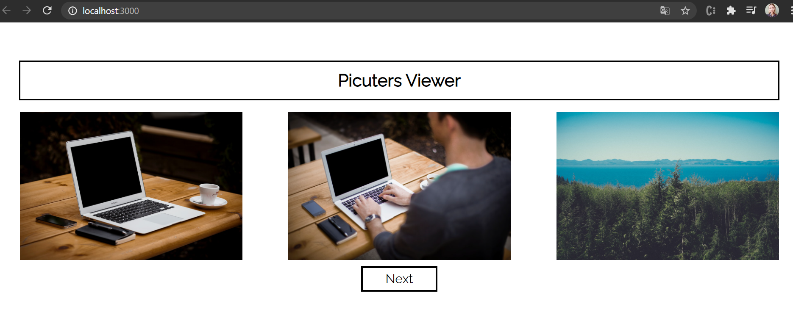
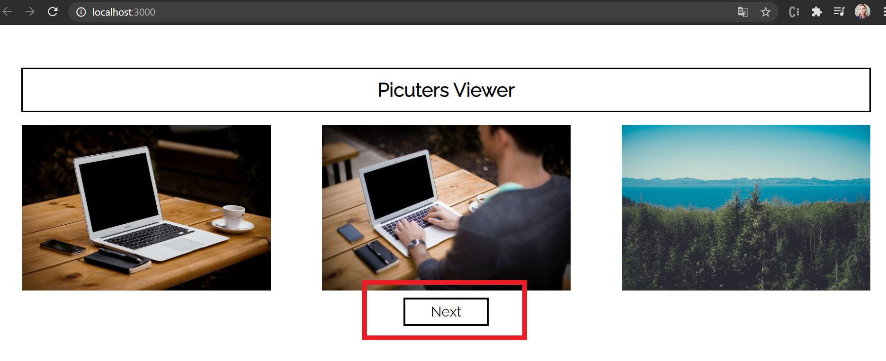

# Pictures Viewr App  
is super simple app that fetch list of photos, and display first 3 of them.

## Comends to start:

`npm start`

## Technologies used:

-HTML,
-CSS,
-React.

## How it look:
 Start page of app shows first 3 fetched photos.

Next button - clicking on this button will display the next 3 fetched photos:

## Current structure of project

- **node_modules..**
- **font** - folder with fonts used in app
- **public**
    - index.html - base html structure
    - index.css - styling index.html

- **src**
    - **components** - folder with components used in app and files with styling these components. 
 
    - App.js (function that returns start page of App)
    - Images.js (showing Images)
    - Images.css (styling for Images.js)
    - RenderingImages.js (component to fetch data and rendering them on screen)
    - RenderingImages.css (styling for RenderingImages.js)
    - index.js
    

